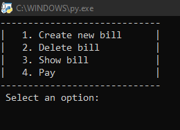

# Cash Register

   Este proyecto parte de la idea de crear un sistema de caja registradora en donde el usuario pueda:
   
- Crear una nueva factura, la cual contenga los datos del cliente tales como Nombre, Identificacion, Numero de telefono y Direccion.
- Ademas la factura contine una lista de productos que han sido seleccionados por el cliente con los datos de Identificación del producto, Nombre del producto, Precio y Cantidad
- Eliminar la factura creada
- Ver la factura creada
- Y pagar el total de la factura

Por el momento todas estas acciones el usuario las realizara por consola, pero se espera que conforme avance en mi proceso de aprendizaje pueda diseñar una pequeña interfaz para el proyecto.
   
Además, se desea agregar el proceso de almacenamiento de los datos ingresados en una base de datos relacional desde Python con el módulo MySQLdb.

  
